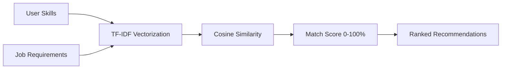

<div align="center">

# 🎯 HireFlow

### *AI-Powered Job Recruitment Platform*

[](https://github.com)
[](https://docker.com)
[](https://reactjs.org)
[](https://nodejs.org)
[](LICENSE)

**Smart job matching with AI-powered skill recommendations, resume uploads, and real-time messaging**

[Features](#-features) • [Status](#-current-status) • [Quick Start](#-quick-start) • [Tech Stack](#-tech-stack) • [API](#-api-endpoints)

  

</div>

---

## 📊 Current Status

| Component | Status | Details |
|-----------|--------|---------|
| **Frontend** | ✅ Production Ready | React 18, Vite, Tailwind CSS, Redux, Dark Mode Support |
| **Backend** | ✅ Production Ready | Node.js/Express, JWT Auth, CORS Enabled, Real-time Socket.IO |
| **Database** | ✅ MySQL 8.0 | SSL Connections, Automated Backups Ready |
| **AI Service** | ✅ Optional | Python Flask, TF-IDF Matching, Scikit-learn |
| **File Uploads** | ✅ Cloudinary | Resume uploads working, image optimization |
| **Face Recognition** | ⚠️ Optional | CompreFace integration available (disabled by default) |
| **Deployment** | ✅ Azure Ready | Docker containers, can run on VM or Container Instances |
| **Real-time Features** | ✅ Socket.IO | Messages, Notifications, Activity Feed, User Presence |

---

## ✨ Features

<table>
<tr>
<td width="33%">

### 👨‍💼 Job Seekers
- 🤖 **AI Recommendations**  
  Smart job matching based on skills
- 📄 **Resume Manager**  
  Cloud storage via Cloudinary
- 📊 **Track Applications**  
  Real-time status updates
- 💬 **Direct Messaging**  
  Chat with recruiters in real-time
- 🔖 **Save Jobs**  
  Bookmark positions for later
- 📈 **Activity Dashboard**  
  Track your hiring journey

</td>
<td width="33%">

### 💼 Recruiters
- 🎯 **Smart Filtering**  
  Skill-based applicant matching
- 🏢 **Company Profile**  
  Showcase your brand
- 📈 **Hiring Analytics**  
  Insights & metrics
- ✏️ **Job Management**  
  Post, edit, delete positions
- 👥 **Applicant Tracking**  
  Manage applications
- 💬 **Recruiter Messaging**  
  Direct communication

</td>
<td width="33%">

### 🛡️ Admins
- 👥 **User Control**  
  Approve/suspend accounts
- 📊 **Platform Analytics**  
  Comprehensive metrics
- 🔒 **Security**  
  Role-based access control
- 🔍 **Content Moderation**  
  Oversight tools
- 📋 **Job Listings**  
  Manage all jobs
- 🎛️ **AI Service Control**  
  Toggle AI features

</td>
</tr>
</table>

---

## 🛠️ Tech Stack

<div align="center">

| 🎨 Frontend | 🔧 Backend | 🤖 AI/ML | ☁️ Services |
|:---:|:---:|:---:|:---:|
| React 18 | Node.js 20 | Python 3.11 | Docker |
| Vite | Express 4 | Scikit-learn | Cloudinary |
| Tailwind CSS | MySQL 8.0 | TF-IDF | Socket.IO |
| Redux Toolkit | JWT Auth | Flask | CORS |

</div>

---

## 🚀 Quick Start

### Option 1: Local Development (Recommended)

```powershell
# 1️⃣ Clone repository
git clone https://github.com/NinadHebbar1029/HireFlow.git
cd HireFlow

# 2️⃣ Start MySQL (ensure MySQL server is running)
# Windows: Use MySQL Workbench or MySQL Command Line

# 3️⃣ Start Backend (Terminal 1)
cd backend
npm install
npm start

# 4️⃣ Start Frontend (Terminal 2)
cd frontend
npm install
npm run dev

# 5️⃣ Start AI Service (Optional - Terminal 3)
.\start-ai-service.ps1
# Or manually: cd ai-service && pip install -r requirements.txt && python app.py

# 6️⃣ Access Application
# 🌐 Frontend: http://localhost:3000
# 🔌 Backend:  http://localhost:5000
# 🤖 AI Service: http://localhost:8080 (if running)
```

### Option 2: Docker (All-in-One)

```bash
# 1️⃣ Configure environment
cp .env.example .env
# Edit .env with your credentials

# 2️⃣ Launch all services
docker-compose up -d

# 3️⃣ Access application
# 🌐 Frontend: http://localhost:3000
# 🔌 Backend:  http://localhost:5000
```

### 🔧 Environment Configuration

<details>
<summary><b>📝 Required Environment Variables</b></summary>

**Backend (.env in `/backend`)**
```env
# Database Configuration
DB_HOST=localhost
DB_PORT=3306
DB_USER=root
DB_PASSWORD=your_password
DB_NAME=hireflow_db

# Authentication
JWT_SECRET=your_jwt_secret_minimum_32_characters

# Cloudinary (Required for resume uploads)
CLOUDINARY_CLOUD_NAME=your_cloud_name
CLOUDINARY_API_KEY=your_api_key
CLOUDINARY_API_SECRET=your_api_secret

# Server
NODE_ENV=development
PORT=5000
```

**Frontend (.env in `/frontend`)**
```env
# API Configuration
VITE_API_URL=http://localhost:5000
```

> 💡 **Get free accounts:**
> - [Cloudinary](https://cloudinary.com/users/register/free) - Free tier includes 25GB storage
> - [MySQL Community](https://dev.mysql.com/downloads/mysql/) - Open source database

</details>

---

## 📂 Project Structure

```
HireFlow/
├── 🎨 frontend/               # React 18 Application
│   ├── src/
│   │   ├── components/        # Reusable UI components
│   │   ├── pages/             # Route pages (27 total)
│   │   ├── contexts/          # Theme & Socket context
│   │   ├── redux/             # State management
│   │   ├── utils/             # API client & helpers
│   │   └── App.jsx            # Main app component
│   ├── package.json
│   └── tailwind.config.js     # Tailwind configuration
│
├── 🔧 backend/                # Express.js REST API
│   ├── routes/                # API endpoints (11 modules)
│   ├── middleware/            # Auth & validation
│   ├── config/                # DB & Cloudinary config
│   ├── database/              # SQL schemas
│   ├── server.js              # Express server
│   └── package.json
│
├── 🤖 ai-service/             # Python ML Service
│   ├── app.py                 # Flask API
│   └── requirements.txt       # Python dependencies
│
├── 🐳 docker-compose.yml      # Container orchestration
├── README.md                  # This file
└── .env.example              # Environment template
```

---

## 🔌 API Endpoints Summary

### Authentication
- `POST /api/auth/register` - Register new account
- `POST /api/auth/login` - User login
- `POST /api/auth/logout` - User logout

### Jobs
- `GET /api/jobs` - List all jobs (with filters)
- `POST /api/jobs` - Create job (recruiters)
- `PUT /api/jobs/:id` - Update job
- `DELETE /api/jobs/:id` - Delete job

### Applications
- `GET /api/applications/my-applications` - Get user applications
- `POST /api/applications` - Submit application
- `POST /api/applications/save-job` - Save job for later
- `DELETE /api/applications/save-job/:jobId` - Unsave job

### Job Seekers
- `GET /api/job-seekers/profile` - Get profile
- `PUT /api/job-seekers/profile` - Update profile
- `POST /api/job-seekers/resume` - Upload resume (Cloudinary)
- `GET /api/job-seekers/recommendations` - AI job matches

### Messages & Notifications
- `GET /api/messages` - Get messages
- `POST /api/messages` - Send message
- `GET /api/notifications` - Get notifications

<sub>Full API documentation available in [`/backend/routes/`](./backend/routes/)</sub>

---

## 🤖 AI Matching Engine

The AI recommendation system uses **TF-IDF (Term Frequency-Inverse Document Frequency)** vectorization:

```
User Profile (Skills) → TF-IDF Vector
Job Description → TF-IDF Vector
                ↓
        Cosine Similarity
                ↓
        Match Score (0-100%)
                ↓
     Ranked Job Recommendations
```

**Features:**
- 🔢 NLP-based skill matching
- 📊 Cosine similarity calculation
- 🎯 Intelligent ranking
- ✅ Filters by minimum requirements
- 🔄 Falls back to SQL matching if AI service is unavailable

---

## 🐳 Docker & Deployment

### Run Locally with Docker
```bash
# Start all services
docker-compose up -d

# View logs
docker-compose logs -f

# Stop services
docker-compose down

# Full reset
docker-compose down -v && docker-compose up -d
```

### Deploy to Azure VM
```powershell
# 1. Create Azure VM (Ubuntu/Linux recommended)
# 2. SSH into VM
# 3. Install Docker & Docker Compose
# 4. Clone repository
# 5. Configure .env with production credentials
# 6. Run: docker-compose up -d
```

---

## 🔒 Security & Best Practices

| Category | Implementation |
|----------|-----------------|
| **Authentication** | ✅ JWT tokens, Bcrypt hashing, Role-based access |
| **Authorization** | ✅ RBAC (Role-Based Access Control) |
| **Data Protection** | ✅ SQL injection prevention, XSS protection |
| **Network** | ✅ CORS enabled, HTTPS ready |
| **File Uploads** | ✅ Cloudinary with validation |
| **Database** | ✅ SSL connections, prepared statements |

---

## 🚨 Known Issues & Fixes

| Issue | Status | Details |
|-------|--------|---------|
| Save/Unsave Jobs | ✅ Fixed | Added missing DELETE endpoint for job unsaving |
| Resume Upload | ✅ Working | Cloudinary integration functional |
| Real-time Messages | ✅ Working | Socket.IO connection established |
| Dark Mode | ✅ Added | Theme context with system preference detection |

---

## 📝 Recent Updates

- ✅ **Oct 18, 2025** - Fixed save/unsave job endpoints, added detailed error logging
- ✅ **Oct 17, 2025** - Dark mode support implemented with Theme Context
- ✅ **Oct 16, 2025** - Deleted Azure Container Instance deployments (cost optimization)
- ✅ **Oct 14, 2025** - Resume upload working with Cloudinary integration
- ✅ **Oct 13, 2025** - Real-time messaging and notifications implemented

---

## 📧 Support & Contact

- 🐛 **Report Issues**: [GitHub Issues](https://github.com/NinadHebbar1029/HireFlow/issues)
- 💡 **Request Features**: [GitHub Discussions](https://github.com/NinadHebbar1029/HireFlow/discussions)
- 📧 **Email**: ninadhebbar2006@gmail.com

---

## 📄 License

This project is licensed under the **MIT License** - see the [LICENSE](LICENSE) file for details.

---

<div align="center">

### 🌟 Built with ❤️ for RIT SEM-V Capstone Project

[](https://github.com/NinadHebbar1029)
[](CONTRIBUTING.md)

**[🐛 Report Bug](https://github.com/NinadHebbar1029/HireFlow/issues)** • **[💡 Request Feature](https://github.com/NinadHebbar1029/HireFlow/issues)** • **[⭐ Star Repo](https://github.com/NinadHebbar1029/HireFlow)**

---

*HireFlow - Connecting talent with opportunity through intelligent job matching* 🚀

</div>

---

## 🔌 API Endpoints

| Method | Endpoint | Description |
|--------|----------|-------------|
| `POST` | `/api/auth/register` | 📝 Register new user |
| `POST` | `/api/auth/login` | 🔐 User authentication |
| `GET` | `/api/jobs` | 📋 List all jobs (with filters) |
| `POST` | `/api/jobs` | ➕ Create job posting |
| `POST` | `/api/applications` | ✍️ Apply for job |
| `GET` | `/api/job-seekers/recommendations` | 🤖 AI job matches |

<sub>Full API documentation available in [`/backend/routes/`](./backend/routes/)</sub>

---

## 🤖 AI Matching Engine

<div align="center">



</div>

**How it works:**
- 🔢 Converts skills to numerical vectors using **TF-IDF algorithm**
- 📊 Calculates similarity between user profile & job requirements
- 🎯 Returns jobs ranked by match score (0-100%)
- ✅ Filters jobs based on minimum skill requirements

---

## 🐳 Docker Commands

```bash
# 🚀 Start all services
docker-compose up -d

# 📊 View logs
docker-compose logs -f

# ⏸️ Stop services
docker-compose down

# 🔄 Reset everything (fresh start)
docker-compose down -v && docker-compose up -d
```

<details>
<summary><b>🔧 Development Mode (Without Docker)</b></summary>

```bash
# Terminal 1 - Backend
cd backend
npm install
node server.js

# Terminal 2 - Frontend
cd frontend
npm install
npm run dev

# Terminal 3 - AI Service
cd ai-service
pip install -r requirements.txt
python app.py
```

</details>

---

## 🔒 Security & Best Practices

<table>
<tr>
<td width="50%">

**🛡️ Authentication**
- ✅ JWT token-based auth
- ✅ Bcrypt password hashing
- ✅ Role-based access (RBAC)
- ✅ Protected API routes

</td>
<td width="50%">

**🔐 Data Protection**
- ✅ SQL injection prevention
- ✅ XSS protection
- ✅ CORS enabled
- ✅ Secure file uploads

</td>
</tr>
</table>

---

## 📄 License

This project is licensed under the **MIT License** - see the [LICENSE](LICENSE) file for details.

---

<div align="center">

### 🌟 Made with ❤️ by developers, for developers

[](https://github.com/yourusername/hireflow)
[](https://github.com/yourusername/hireflow/fork)

**[⭐ Star this repo](https://github.com/yourusername/hireflow)** • **[🐛 Report Bug](https://github.com/yourusername/hireflow/issues)** • **[💡 Request Feature](https://github.com/yourusername/hireflow/issues)**

---

*HireFlow - Connecting talent with opportunity through intelligent automation* 🚀

</div>
