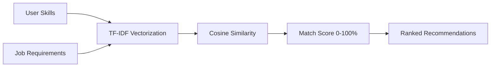

<div align="center">

# 🎯 HireFlow

### *AI-Powered Job Recruitment Platform*

[](https://github.com)
[](https://docker.com)
[](https://reactjs.org)
[](https://nodejs.org)
[](LICENSE)

**Smart job matching with AI-powered skill recommendations**

[Features](#-features) • [Quick Start](#-quick-start) • [Tech Stack](#-tech-stack) • [API](#-api-endpoints)

  

</div>

---

## ✨ Features

<table>
<tr>
<td width="33%">

### 👨‍💼 Job Seekers
- 🤖 **AI Recommendations**  
  Smart job matching
- 📄 **Resume Manager**  
  Cloud storage
- 📊 **Track Applications**  
  Real-time status
- 💬 **Direct Messaging**  
  Chat with recruiters

</td>
<td width="33%">

### 💼 Recruiters
- 🎯 **Smart Filtering**  
  Skill-based matching
- 🏢 **Company Profile**  
  Showcase your brand
- 📈 **Analytics**  
  Hiring insights
- ✏️ **Job Management**  
  Post, edit, delete

</td>
<td width="33%">

### 🛡️ Admins
- 👥 **User Control**  
  Approve/suspend users
- 📊 **Analytics**  
  Platform metrics
- 🔒 **Security**  
  Access management
- 🔍 **Moderation**  
  Content oversight

</td>
</tr>
</table>

---

## 🛠️ Tech Stack

<div align="center">

| 🎨 Frontend | 🔧 Backend | 🤖 AI/ML | ☁️ Services |
|:---:|:---:|:---:|:---:|
| React 18 | Node.js 20 | Python 3.11 | Docker |
| Vite | Express | Scikit-learn | Cloudinary |
| Tailwind CSS | MySQL 8.0 | TF-IDF | CompreFace* |
| Redux Toolkit | JWT Auth | Flask | - |

<sub>*Optional biometric authentication</sub>

</div>

---

## 🚀 Quick Start

### Option 1: Docker (Recommended)

```bash
# 1️⃣ Clone repository
git clone https://github.com/yourusername/hireflow.git
cd hireflow

# 2️⃣ Configure environment
cp .env.example .env
# Edit .env with your credentials (see below)

# 3️⃣ Launch with Docker
docker-compose up -d

# 4️⃣ Access application
# 🌐 Frontend: http://localhost:3000
# 🔌 Backend:  http://localhost:5000
# 🤖 AI Service: http://localhost:8080
```

### Option 2: Manual Setup

```powershell
# 1️⃣ Start Database (MySQL)
# Install and start MySQL server

# 2️⃣ Start Backend
cd backend
npm install
# Configure .env file
npm start

# 3️⃣ Start Frontend (new terminal)
cd frontend
npm install
npm run dev

# 4️⃣ Start AI Service (new terminal)
# Option A: Use helper script
.\start-ai-service.ps1

# Option B: Manual start
cd ai-service
pip install -r requirements.txt
python app.py
```

### 🤖 AI Recommendations

The AI service is **optional** but recommended for intelligent job matching:

- **Running**: Provides AI-powered job recommendations using TF-IDF and skill matching
- **Not Running**: Automatically falls back to SQL-based skill matching

**To start AI service:**
```powershell
.\start-ai-service.ps1
# OR manually: cd ai-service && python app.py
```

**Check status:** Admin Dashboard → Settings → AI Service Status Panel

<details>
<summary><b>📝 Environment Variables</b></summary>

```env
# Database
MYSQL_ROOT_PASSWORD=your_secure_password
MYSQL_DATABASE=hireflow_db

# Authentication
JWT_SECRET=your_jwt_secret_minimum_32_characters

# Cloudinary (Required - free tier available)
CLOUDINARY_CLOUD_NAME=your_cloud_name
CLOUDINARY_API_KEY=your_api_key
CLOUDINARY_API_SECRET=your_api_secret

# Optional: Face Recognition
COMPREFACE_API_KEY=your_key
COMPREFACE_POSTGRES_PASSWORD=postgres_password
```

> 💡 **Get Cloudinary free account:** [cloudinary.com/signup](https://cloudinary.com/users/register/free)

</details>

---

## 📂 Project Structure

```
HireFlow/
├── 🎨 frontend/           # React application (27 pages)
│   ├── public/           # Static assets
│   └── src/
│       ├── components/   # Reusable components
│       ├── pages/        # Route pages
│       ├── redux/        # State management
│       └── utils/        # API client
│
├── 🔧 backend/            # Express.js API (11 modules)
│   ├── routes/           # API endpoints
│   ├── middleware/       # Auth & validation
│   ├── config/           # Database & services
│   └── database/         # SQL schemas
│
├── 🤖 ai-service/         # Python ML service
│   ├── app.py           # Flask API
│   └── requirements.txt
│
└── 🐳 docker-compose.yml  # Container orchestration
```

---

## 🔌 API Endpoints

| Method | Endpoint | Description |
|--------|----------|-------------|
| `POST` | `/api/auth/register` | 📝 Register new user |
| `POST` | `/api/auth/login` | 🔐 User authentication |
| `GET` | `/api/jobs` | 📋 List all jobs (with filters) |
| `POST` | `/api/jobs` | ➕ Create job posting |
| `POST` | `/api/applications` | ✍️ Apply for job |
| `GET` | `/api/job-seekers/recommendations` | 🤖 AI job matches |

<sub>Full API documentation available in [`/backend/routes/`](./backend/routes/)</sub>

---

## 🤖 AI Matching Engine

<div align="center">



</div>

**How it works:**
- 🔢 Converts skills to numerical vectors using **TF-IDF algorithm**
- 📊 Calculates similarity between user profile & job requirements
- 🎯 Returns jobs ranked by match score (0-100%)
- ✅ Filters jobs based on minimum skill requirements

---

## 🐳 Docker Commands

```bash
# 🚀 Start all services
docker-compose up -d

# 📊 View logs
docker-compose logs -f

# ⏸️ Stop services
docker-compose down

# 🔄 Reset everything (fresh start)
docker-compose down -v && docker-compose up -d
```

<details>
<summary><b>🔧 Development Mode (Without Docker)</b></summary>

```bash
# Terminal 1 - Backend
cd backend
npm install
node server.js

# Terminal 2 - Frontend
cd frontend
npm install
npm run dev

# Terminal 3 - AI Service
cd ai-service
pip install -r requirements.txt
python app.py
```

</details>

---

## 🔒 Security & Best Practices

<table>
<tr>
<td width="50%">

**🛡️ Authentication**
- ✅ JWT token-based auth
- ✅ Bcrypt password hashing
- ✅ Role-based access (RBAC)
- ✅ Protected API routes

</td>
<td width="50%">

**🔐 Data Protection**
- ✅ SQL injection prevention
- ✅ XSS protection
- ✅ CORS enabled
- ✅ Secure file uploads

</td>
</tr>
</table>

---

## 📄 License

This project is licensed under the **MIT License** - see the [LICENSE](LICENSE) file for details.

---

<div align="center">

### 🌟 Made with ❤️ by developers, for developers

[](https://github.com/yourusername/hireflow)
[](https://github.com/yourusername/hireflow/fork)

**[⭐ Star this repo](https://github.com/yourusername/hireflow)** • **[🐛 Report Bug](https://github.com/yourusername/hireflow/issues)** • **[💡 Request Feature](https://github.com/yourusername/hireflow/issues)**

---

*HireFlow - Connecting talent with opportunity through intelligent automation* 🚀

</div>
